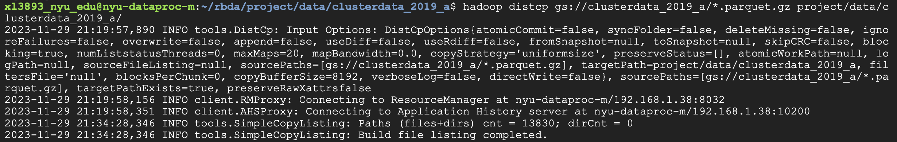
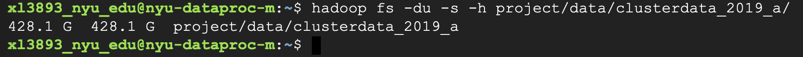
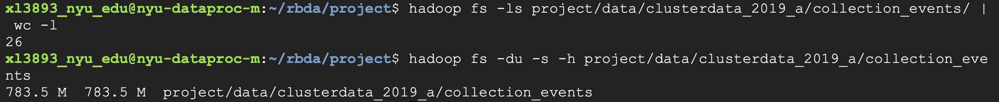
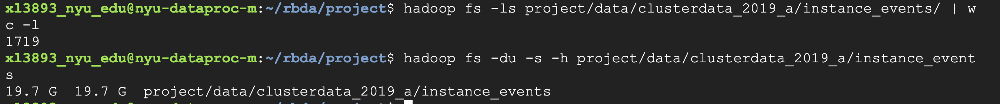
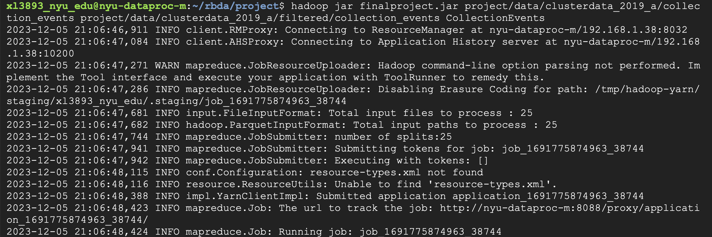
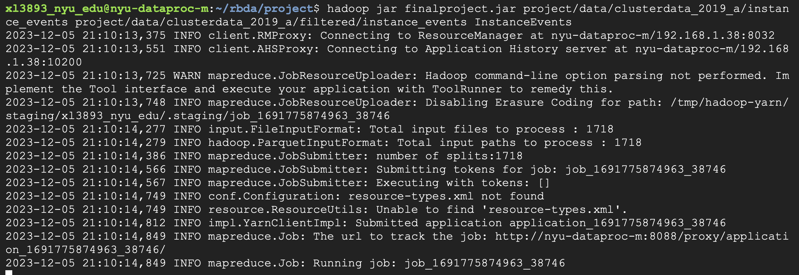
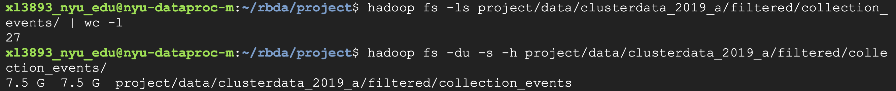
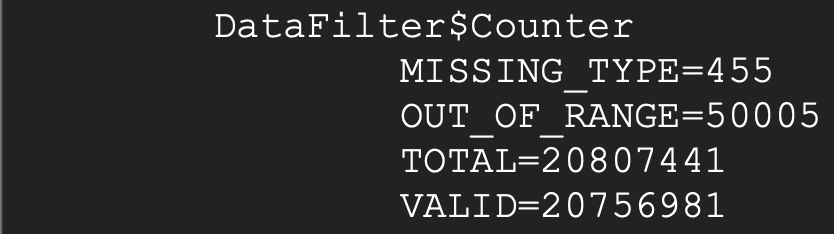
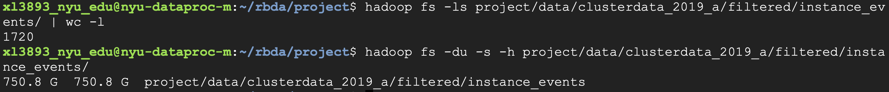
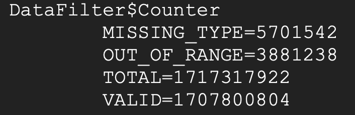

# Project - Data Ingestion and Cleaning

`Xiaoteng (Frank) Liu`

`xl3893`

## Data Ingestion

Tracing data is stored on google cloud. Here's the command I used to load the to HDFS on Dataproc:
`hadoop distep gs://clusterdata_2019_a/*.parquet.gz project/data/clusterdata_2019_a`.





## Format Description

> Please find a shard of the input and output field in the `sampleData` folder.

All of the files are in parquet format.

The files names are in the format `TABLE_NAME-[0-9]+.parquet.gz`, where the number are the horizontal shard.
For example, `collection_events-000000000000.parquet.gz`represents the first shard of the `collection_events` table.

There are five tables, two of which are currently of our interest:

`collection_events` and `instance_events`.

Schema of `collection_events`:
```
{
  optional int64 time;
  optional int64 type;
  optional int64 collection_id;
  optional int64 scheduling_class;
  optional int64 missing_type;
  optional int64 collection_type;
  optional int64 priority;
  optional int64 alloc_collection_id;
  optional binary user (STRING);
  optional binary collection_name (STRING);
  optional binary collection_logical_name (STRING);
  optional int64 parent_collection_id;
  required group start_after_collection_ids (LIST) {
    repeated group list {
      required int64 element;
    }
  }
  optional int64 max_per_machine;
  optional int64 max_per_switch;
  optional int64 vertical_scaling;
  optional int64 scheduler;
}
```

collection_events example: ```{"time": 1965263509076, "type": 3, "collection_id": 394454435790, "scheduling_class": 1, "missing_type": null, "collection_type": 0, "priority": 200, "alloc_collection_id": null, "user": "+OVSEukSmo6ma+28nY4raBvhviWrpQLsc+DWQcTGV4E=", "collection_name": "1ydOjEQztmaDldivyXuwO0MJeGCA3QC5H8SFU0GffHM=", "collection_logical_name": "EtxQRC/xETMeVuCiiEiMaiyqIUI8YomWaxXsO91ad14=", "parent_collection_id": 394454434726, "start_after_collection_ids": [], "max_per_machine": null, "max_per_switch": null, "vertical_scaling": 3, "scheduler": 0}```


Schema of `instance_events`:
```
{
  optional int64 time;
  optional int64 type;
  optional int64 collection_id;
  optional int64 scheduling_class;
  optional int64 missing_type;
  optional int64 collection_type;
  optional int64 priority;
  optional int64 alloc_collection_id;
  optional int64 instance_index;
  optional int64 machine_id;
  optional int64 alloc_instance_index;
  optional group resource_request {
    optional double cpus;
    optional double memory;
  }
  required group constraint (LIST) {
    repeated group list {
      required group element {
        optional binary name (STRING);
        optional binary value (STRING);
        optional int64 relation;
      }
    }
  }
}
```

instance_events example: ```{"time": 535439029406, "type": 0, "collection_id": 380676713775, "scheduling_class": 0, "missing_type": 3, "collection_type": 1, "priority": 0, "alloc_collection_id": 0, "instance_index": 0, "machine_id": null, "alloc_instance_index": -1, "resource_request": null, "constraint": []}```


## Data Cleaning

Both tables have a field `missing_type`, if not null, indicates that the record is missing some information.
We will remove all records with `missing_type` not null.

The field 'time' indicate the start time of the event.
The tracing starts at 600s, and a time of 0 indicates that the event started before the tracing started.
We remove all such records as well.

Not all fields are of our interest, so we will only keep the following fields:

For `collection_events`, we have the following schema:
```
{
  optional int64 time;
  optional int64 type;
  optional int64 collection_id;
  optional int64 priority;
  optional binary user (STRING);
  optional binary collection_name (STRING);
  optional binary collection_logical_name (STRING);
  optional int64 parent_collection_id;
  required group start_after_collection_ids (LIST) {
    repeated group array {
      required int64 element;
    }
  }
  optional int64 vertical_scaling;
  optional int64 scheduler;
}
```

Example of a resulting record: ```{"time": 2473861798933, "type": 6, "collection_id": 399475611730, "priority": 115, "user": "+3Or0zjiTkLBDAV7IVth75JTKUOVJKvvxQQSWQc/5hw=", "collection_name": "+wFrtexurbMXWHJ4oprU3JRPl/y6wIscS9R7LCo5gLE=", "collection_logical_name": "0lfur+La8rDd4vnZt65v/LkJuGwVoi/6zDoIneSdzjI=", "parent_collection_id": null, "start_after_collection_ids": [], "vertical_scaling": 3, "scheduler": 1}```

For `instance_events`:
```
{
  required int64 time;
  required int64 type;
  required int64 collection_id;
  required int64 priority;
  required int64 instance_index;
  optional int64 machine_id;
  optional group resource_request {
    optional double cpus;
    optional double memory;
  }
  required group constraint (LIST) {
    repeated group array {
      optional binary name (STRING);
      optional binary value (STRING);
      optional int64 relation;
    }
  }
}
```

Example of a resulting record: ```{"time": 1072407407114, "type": 2, "collection_id": 383156594439, "priority": 0, "instance_index": 20, "machine_id": null, "resource_request": {"cpus": 0.0, "memory": 0.0}, "constraint": []}```

## Data Profiling

We keep a counter for the total number of records in each table, and the number of records removed due to missing information or starting before the tracing started.
VALID = TOTAL - MISSING_TYPE - OUT_OF_RANGE

```java
enum Counter {
    TOTAL, VALID, MISSING_TYPE, OUT_OF_RANGE
}
```

## Using MapReduce

We use a filter pattern, with mapper only.

We use `ParquetInputFormat` and `AvroReadSupport` for reading.

Each mapper maps to a shard. The input key is ignored, and the input value is an individual record. It then checks if the record is valid, and writes the cleaned record, where the output key is ignored, and the output value is the cleaned record.

All the output records are of `Text` type, not compressed. The number of output files is the same as the number of input shards.

The program is given with three input arguments: the input path, the output path, and the table name.

The source code is in `DataFilter.java`, and the dependencies are in `pom.xml`.

### Running on Dataproc

The shards of `collection_events` are stored in `project/data/clusterdata_2019_a/collection_events`.


There are 26 shards.

The shards of `instance_events` are stored in `project/data/clusterdata_2019_a/instance_events`.


And `instance_events` have 1719 shards.

We first process the `collection_events` table:
```shell
hadoop jar finalproject.jar project/data/clusterdata_2019_a/collection_events project/data/clusterdata_2019_a/filtered/collection_events CollectionEvents
```



Then we process the `instance_events` table:
```shell
hadoop jar finalproject.jar project/data/clusterdata_2019_a/instance_events project/data/clusterdata_2019_a/filtered/instance_events InstanceEvents
```



## Results

### collection_events Table

The result is stored in `project/data/clusterdata_2019_a/filtered/collection_events`.


Subtracting the one success message,
we see that number of the output files are the same as the number of input files, which is 26.
The size is larger since the outputs are in text format, not compressed.

Counters:

There's total of 20807441 records.
About than 0.2% of the records are invalid.

### instance_events Table

Output path: `project/data/clusterdata_2019_a/filtered/instance_events`.


Counters:

There's total of 1717317922 records.
About 0.5% of the records are invalid.